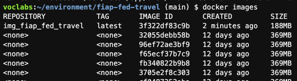
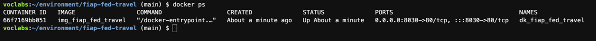
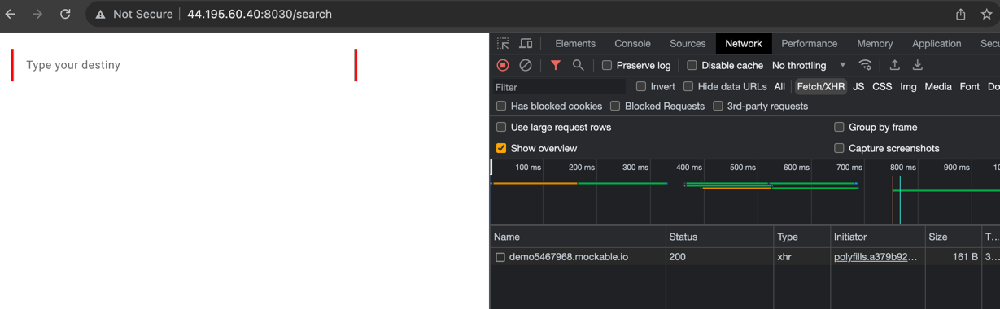
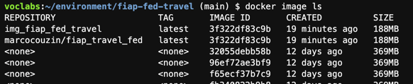
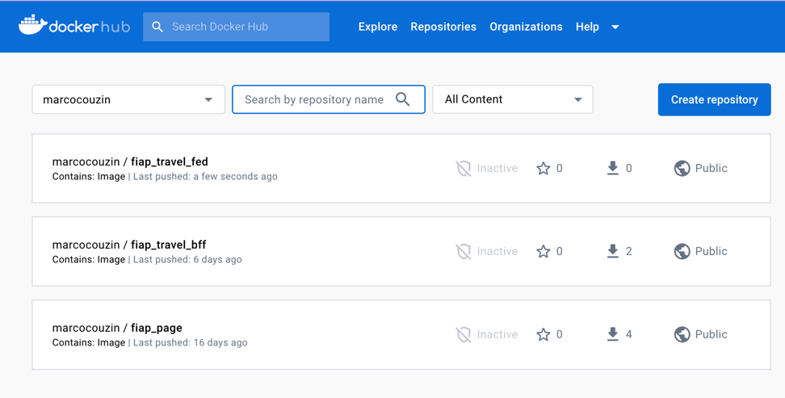

# FED FIAP Travel

## First Step - Generate a Docker image

1. Download the source code in the Cloud9
```
git clone https://github.com/marcocouzin/fiap-fed-travel.git
```
2. Access the application directory
```
cd fiap-fed-travel/
```
3. Create the container image
```
docker build -t img_fiap_fed_travel .
```
4. Check if the image was created
```
docker images
```

5. Run the container
```
docker run --name dk_fiap_fed_travel -p 8030:80 -d img_fiap_fed_travel
```
6. Check if the container is running
```
docker ps
```


7. Test the solution
- Get the external IP
```
../ip
```
8. On you browser, access
```
http://<ip>:8030
```



#
## Step Two - Publish the image on Docker Hub
1. Sign in Docker Hub
```
docker login
```
2. Prepare the image to be published
```
docker tag img_fiap_fed_travel:latest marcocouzin/fiap_travel_fed:latest
```
3. Check the tag image
```
docker image ls
```

4. Publish the image to Docker Hub
```
docker push marcocouzin/fiap_travel_fed:latest
```

